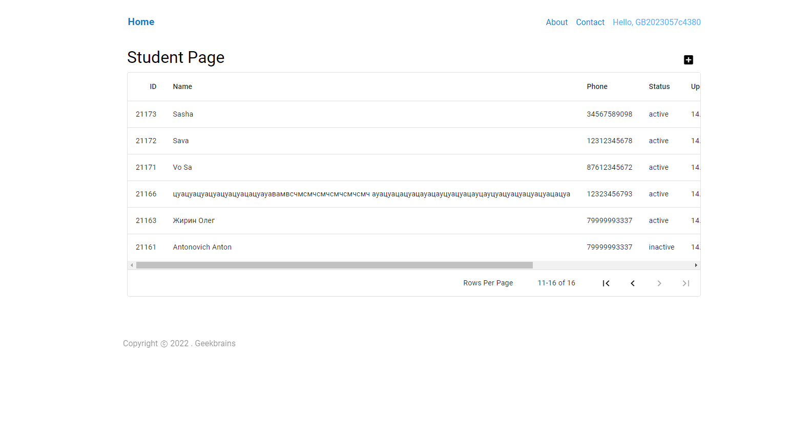

# Урок 1. Клиент-серверная архитектура

Аккаунты на GeekTest

Необходимо:

* ознакомиться с описанием проекта,
* авторизоваться в выданную преподавателем учетную запись,
* создать 1 - 5 тестовых пользователей в личном кабинете Ссылка на документацию: https://docs.google.com/document/d/1jzq2RsU0_3ULU-1oj6zatqsGvrhMRyYZ5gWT0-CtlUs/edit?usp=sharing

Solution:

Созданные пользователи: 

## Отчет по дефектам

Наденные дефекты в ходе работы: <a href="https://docs.google.com/spreadsheets/d/12sZiqqYKPHPJCE0DlTCVGSx9APgyQUZeizWfhLs8l50/edit?usp=sharing">Google sheets</a> 
