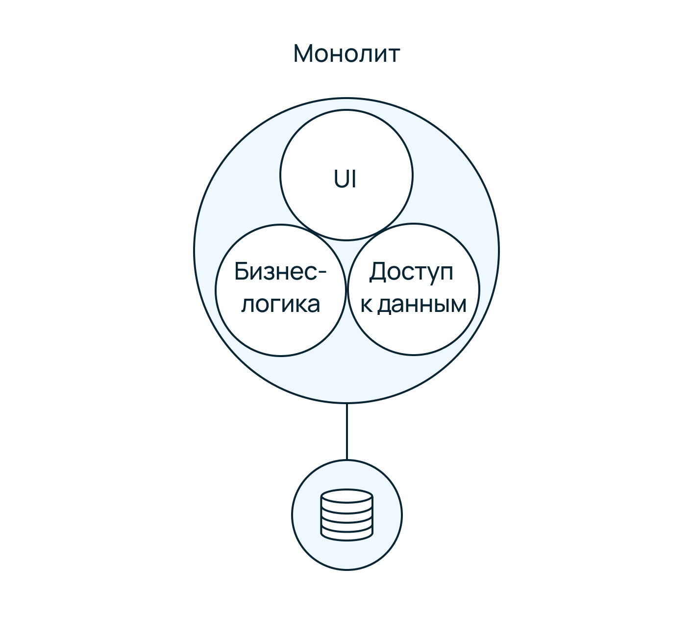

# Клиент-серверная архитектура

__План урока:__

* что такое клиент-серверная архитектура;
* типы клиентов;
* балансировщик;
* виды виды клиент-серверной архитектуры;
* что такое API;
* виды API;
* HTTP/S;
* Swagger;
* Postman. 

«Клиент — сервер» (англ. client–server) — структура, в которой сетевая нагрузка распределена между поставщиками услуг (серверами), и заказчиками услуг (клиентами).

__НО кто такие клиенты? Что такое серверы?__

Клиентом может быть любая Desktop/mobile программа. Например, мобильное приложение Ozon, Юла, Wildberries — клиенты. Браузер, которым вы пользуетесь прямо сейчас также является клиентом, поскольку запрашивает информацию у сервера посредством протоколов. 

Сервер — мощная вычислительная машина, на которой находится приложение или сайт. Сервер хранит все данные приложения: весь код, вся логика, все дополнительные материалы и справочники.

Параметры, которые могут реализоваться на стороне сервера:

1. Хранение, защита и доступ к данным;
2. Работа с поступающими клиентскими запросами;
3. Процесс отправки ответа клиенту.

Параметры, которые могут реализоваться на стороне клиента:
1. Площадка по предоставлению пользовательского графического интерфейса;
2. Формулировка запроса к серверу и его последующая отправка;
3. Получение итогов запроса и отправка дополнительной группы команд (запросы на добавление, обновление информации, удаление группы данных).

Архитектура системы клиент-сервер формулирует принципы виртуального общения между локальными компьютерами, а все правила и принципы взаимодействия находятся внутри протокола.

Сетевой протокол — это особый набор правил, на основании которого выполняется точное взаимодействие между компьютерами внутри виртуальной сети.

Клиенты посылают запросы на серверы и получают от них ресурсы в виде данных (например, загрузка файлов посредством сетевых протоколов HTTP, FTP, потоковое мультимедиа или работа с базами данных) или в виде сервисных функций (например, работа с электронной почтой, общение посредством систем мгновенного обмена сообщениями или просмотр web-страниц во всемирной паутине).

## Типы клиентов

__Тонкий клиент__ — это когда большую часть нагрузки берет на себя сервер, а не клиент. Вся основная бизнес-логика и вычислительные процессы происходят на стороне сервера.

Пример: приложение для конвертации файлов — из формата docx или txt в PDF. Также можно сюда отнести онлайн-кинотеатры. 

__Толстый клиент__ — приложение, которое обеспечивает расширенную функциональность независимо от центрального сервера. Сервер выступает в качестве хранилища данных, а вся логика работы переносится на машину клиента.

Пример: онлайн игры, бугалтерский софт 1С. 

## Балансировщик

Современным приложениям необходимо обрабатывать миллионы пользователей одновременно. Быстро возвращать каждому правильную картинку, текст, видео и другие данные. Для обработки таких значительных объемов трафика используется множество серверов. Данные между ними дублируются, что обеспечивает стабильную работу приложения при большой нагрузке, а также в случае если один сервер выйдет из строя, то приложение все равно продолжит функционировать. Организацией распределения нагрузки между серверами занимается балансировщик. 

Балансировщик нагрузки (load balancer) — сервис, который помогает серверам эффективно перемещать данные, оптимизирует использование ресурсов доставки приложений и предотвращает перегрузки. 

Также балансировщики выполняют следующие функции:

* функция разгрузки — защищает от распределенных атак типа «отказ в обслуживании» (DDoS); 
* функция прогнозной аналитики — определяет узкие места трафика до того, как они возникнут; 
* функция запуска новых виртуальных хранилищ данных при превышении лимитов входящего трафика.

Балансировщики могут быть как отдельными физическими аппаратными устройствами, так и поставляться в виде программы. Аппаратные устройства работают на основе программного обеспечения, оптимизированного под специализированные процессоры.

## Виды клиент-серверной архитектуры

Архитектура «клиент-сервер» определяет общие принципы организации взаимодействия в сети, где имеются серверы, узлы-поставщики некоторых специфичных функций (сервисов) и клиенты (потребители этих функций). Практические реализации такой архитектуры называются клиент-серверными технологиями.

Существует несколько реализаций:

1. Двухзвенная архитектура 
2. Трехуровневая архитектура
3. Многозвенная архитектура 
4. Монолитная архитектура
5. Микросервисная архитектура 

Рассмотрим подробнее:

__Двухзвенная архитектура__. В данной архитектуре взаимодействие происходит между двумя участниками (клиентом, сервером). На сервере может быть установлен веб-сервис, файловый сервер, база данных. Сервер не вызывает сторонние сетевые приложения и не обращается к сторонним ресурсам для обработки запроса. 

__Трехзвневая архитектура.__ Здесь приложение разделено на 2 и более частей, которые взаимодействуют с собой по определенному формату. Есть клиент, сервер, база данных, которая вынесена на отдельный сервер. 

__Многозвенная архитектура.__ Она имеет структуру трехзвенной архитектуры, однако предполагает наличие несколько резервных копий сервера. Сервер, файловое хранилище.

__Монолитная архитектура.__ Монолитная архитектура — это традиционная модель разработки программного обеспечения, в которой одна база кода используется для выполнения нескольких бизнес-функций. Все программные компоненты монолитной системы взаимозависимы из-за использования встроенных механизмов обмена данными внутри системы. Модификация монолитной архитектуры возможна лишь частично и занимает много времени, поскольку даже небольшие изменения затрагивают большие области базы кода

__Микросервисная архитектура.__ Архитектурный подход на основе микросервисов подразумевает, что программное обеспечение состоит из небольших независимых компонентов (сервисов). Каждый сервис выполняет одну функцию и взаимодействует с другими сервисами через четко определенные интерфейсы. Поскольку они работают независимо, вы можете обновлять, изменять, развертывать или масштабировать каждую службу отдельно по мере необходимости.

## Принципы работы API 

API (Application Programming Interface) — прикладной программный интерфейс. Это набор функций и подпрограмм, обеспечивающий взаимодействие клиентов и серверов. Это определенной набор методов, который можно использовать для доступа к функциональности в другой программе. 
Допустим, что мы хотим добавить в наше приложение курс валют или прогноз погоды, доступ к социальным сетям и возможность регистрироваться в нашем продукте с помощью аккаунта в одной из существующих социальных сетей или почтовой службы. В таком случае на помощь и приходит API Еще апи называются контрактом, общения между клиентом и сервером.  

## Виды API

### SOAP

Simple Object Access Protocol — простой протокол доступа к объектам. Это стандартизированный API с высоким уровнем безопасности, где общение между клиентом и сервером выполняется в формате XML. 

### REST

Representational State Transfer — дословно передача состояния представления. REST является __архитектурным стилем,__ а не протоколом. т.е. REST устанавливает набор правил, которым необходимо следовать, чтобы реализовать приложение, обеспечить обмен данными и возможность масштабирования. Данные в REST могут передаваться в в любом формате: XML, JSON, Atom, RSS, CSV, HTML и другие. 

### GraphQL

GraphQL — это язык запросов для получения данных через API. Это альтернатива REST API. Он не специфичен для одной платформы и работает для всех типов клиентов, включая Android, iOS или веб. Он располагается между сервером и клиентом и помогает запрашивать данные более оптимизированным способом. Запросы GraphQL — это сущности, представляющие собой запрос к серверу на получение неких данных. 

Например, у нас есть некий пользовательский интерфейс, который мы хотим заполнить данными. За этими данными мы и обращаемся к серверу, выполняя запрос. При использовании традиционных REST API наш запрос принимает вид GET-запроса. При работе с GraphQL используется новый синтаксис построения запросов и запросы в этому случае POST: 

Это что, JSON? Или JavaScript-объект? Ни то и ни другое. Как мы уже говорили, в названии технологии GraphQL две последние буквы, QL, означают «query language», то есть — язык запросов. Речь идет, в буквальном смысле, о новом языке написания запросов на получение данных. Звучит все это как описание чего-то довольно сложного, но на самом деле ничего сложного тут нет. 

### gRPC 

gRPC – cистема удаленного вызова процедур с открытым исходным кодом. Это новый  фреймворк для разработки масштабируемых, современных и быстрых API. Он был разработан компанией Google еще в далеком 2015 году. Используется многими ведущими компаниями, такими как Google, Square и Netflix, и позволяет программистам писать микросервисы на любом языке, который они хотят, сохраняя при этом возможность легко устанавливать связь между этими сервисами. 

## Протокол передачи данных HTTP/S

HTTP (HyperText Transfer Protocol — «протокол передачи гипертекста») — протокол прикладного уровня передачи данных в сети интернет, изначально — в виде гипертекстовых документов в формате HTML, в настоящее время используется для передачи произвольных данных. HTTP для передачи содержимого использует надежные службы протокола TCP. 
HTTPS — расширение протокола HTTP для поддержки шифрования в целях повышения безопасности. Данные в протоколе HTTPS передаются в отличие от HTTP с TCP-портом 80, для HTTPS по умолчанию используется TCP-порт 443.

__из чего состоит HTTP-запрос:__ 

1. __Request Line.__ В нем есть первое слово GET, которое является методом. Дальше идет путь (URL), по которому хотим получить данные, и версия протокола. 
2. __Headers.__ Хедеры (заголовки) запроса содержат больше информации о ресурсе, который нужно получить, или о клиенте, запрашивающем ресурс. Заголовки ответа содержат дополнительную информацию об ответе, например его местонахождение, или о сервере, предоставившем его.
3. __Boby.__ Тело запроса содержит информацию, которую передают на сервер, например, данные, которые были введены в форму авторизации.

__из чего состоит HTTP-ответ:__

Также в стек протокола TCP/IP входят и другие известные протоколы передачи данных — UDP, FTP, ICMP, IGMP, SMTP. Эти технологии применяются в частных случаях: например, у SMTP единственное предназначение — отправка электронных писем. 

Основные HTTP-методы: 

* GET - получение ресурса;
* POST - создание ресурса;
* PUT - обновление ресурса;
* DELETE - удаление. 

Статус-коды:

* 100 - информационные;
* 200 - успешно выполненные;
* 300 - перенаправления;
* 400 - ошибки на стороне клиента;
* 500 - ошибки на стороне сервера. 